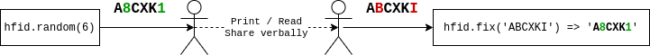

# Overview



A library for generating IDs that are shared verbally or via printed media.
# Use cases
* Order IDs on documents that are prited, e.g. in transportation
* Onine game IDs that are shared via text or verbally in a group, e.g. Among Us game codes
* One-time invite codes

# Features
Does not use ambiguous symbols
Auto-correct common mistakes (mistype or misheard)
## For ID being printed and read
Does not use characters that can be misread as numbers
Letter | Number
--- | ---
T|7
O|0
B|8
I|1

## For ID being shared verbally
Does not use Q or W, since they are easy to be misheard

## Error-correction
Fix function will replace not used chars with their probable origins
Char | Replaced with
--- | ---
T|7
O|0
B|8
I|1
Q|0

# Usage

```javascript
const hfid = require('hfid');

// Generate a random ID
var id = hfid.random(6);

// Fixing user input
var fixedId = hfid.fix('ARTBI'); // returns 'AR781'
```

